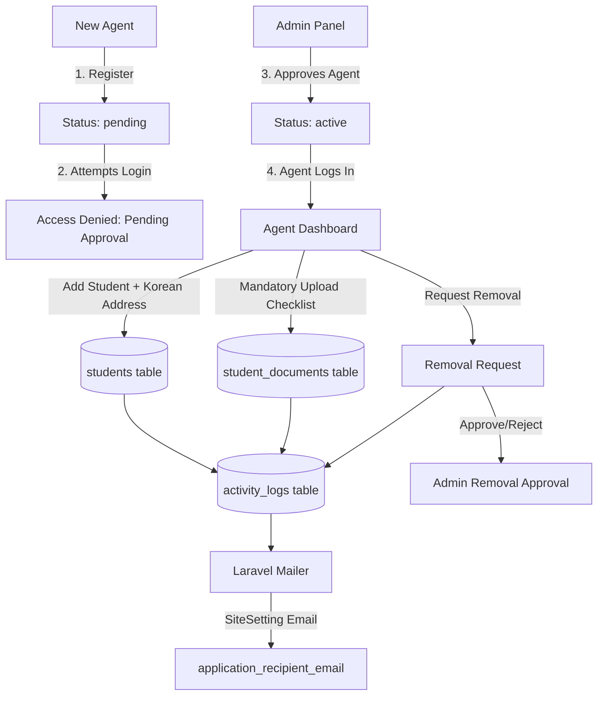

# REIAC Global – Agent Portal & Agency Dashboard Scope (Implementation Plan)

Is plan me **Agent Portal (Registration, Admin Approval, Login, Dashboard)** aur **Agency Scope Features** ka complete Non-Technical & Technical blueprint hai.

---

## 📢 Part 1: Non-Technical Overview (Business & Client Explanation)

Ye system **REIAC Global** ke Agencies/Agents ke liye ek dedicated web portal banayega, jisse agents aasani se apne students ke applications aur documents manage kar sakein, aur Admin har step par update rahe.

### 1. Agent Account & Registration Flow (Admin Approval)
- **Registration**: Jab koi new Agent/Agency form bharega, unka account **"Pending Approval"** state me create hoga.
- **Login Restriction**: Agent tab tak login nahi kar sakta jab tak Admin use review karke **Approve** na kar de. Login karne par message dikhega: *"Your account is pending admin approval."*
- **Admin Approval Panel**: Admin Panel me ek naya section hoga jahan Admin pending agents ki list dekh kar **Approve / Reject / Suspend** kar sakta hai. Approve hone par Agent ko confirmation email milega.

### 2. Modern Agent Dashboard
- Agent login karne ke baad ek clean, attractive, aur fast dashboard dekhega.
- **Stats Counters**: Total Students, Active Applications, Under Review, aur Approved applications ke real-time numbers summary.
- **Quick Controls**: Student search, status filter, and quick action buttons.

### 3. Student Management (Dedicated Records)
- Agent apne students ko add aur view kar sakta hai. Har student record dedicated taur par us Agent se linked hoga.
- **Korean Address Section**: Application create/edit karte waqt Agent Korean Address, City, Postal Code, aur Contact Number fill kar sakta hai. Finalize hone tak ye editable rahega.
- **University Field**: University name table me dikhega par ye field **View-Only** (read-only) rahega Agent ke liye. Administrative actions Admin dwara honge.

### 4. Mandatory Document Upload System (Popup Modal Checklist)
- Single direct file upload ki jagah, **Upload Documents** par click karte hi ek **Checklist Popup Modal** khulega.
- Checklist me 5-6 mandatory documents honge:
  - `✓ Passport`
  - `✓ Academic Transcript`
  - `✓ IELTS / PTE Result`
  - `✓ Financial Statement`
  - `✓ Passport Size Photo`
  - `✓ Offer Letter (If required)`
- Har document ka live upload status (Pending / Uploaded / Verified / Rejected) dikhega. System tab tak full application submit nahi karne dega jab tak saare mandatory documents upload na ho jayein.

### 5. Document Removal Request Workflow (No Direct Delete)
- Agent direct document delete nahi kar sakta.
- **"Delete" button ki jagah "Request Removal"** button hoga.
- Click karne parReason popup khulega. Agent ko removal ka reason likhna hoga.
- Submit karne par Admin ko instantly email notification aur in-app alert chala jayega.
- Admin review karega aur **Approve / Reject** karega. Approve hone par hi document remove hoga aur Agent ko alert milega.

### 6. Admin Email Alert System (Site Settings Configured Email)
- Agent ki taraf se hone wali har important activity par Admin ko automated email notification jayegi (`SiteSetting` me configured email par, e.g., `application_recipient_email`):
  1. Student Created
  2. Student Updated
  3. Document Uploaded
  4. Address Updated
  5. Removal Requested
  6. Profile Updated
  7. Application Update

### 7. Activity Audit Log
- Agent ki har activity (Student add/edit, Document upload, Address update, Removal request) system me time, IP address, aur details ke saath log (record) hogi, jise Admin complete audit log me dekh sakta hai.

---

## 🛠️ Part 2: Technical Architecture & Implementation Blueprint



---

## Technical Specifications & Schema Changes

### 1. Database Migrations & Models

#### Migration 1: `create_agents_table`
```sql
CREATE TABLE agents (
    id BIGINT AUTO_INCREMENT PRIMARY KEY,
    name VARCHAR(255) NOT NULL,
    agency_name VARCHAR(255) NOT NULL,
    email VARCHAR(255) UNIQUE NOT NULL,
    password VARCHAR(255) NOT NULL,
    phone VARCHAR(50) NULL,
    country VARCHAR(100) NULL,
    address TEXT NULL,
    status ENUM('pending', 'active', 'suspended') DEFAULT 'pending',
    remember_token VARCHAR(100) NULL,
    email_verified_at TIMESTAMP NULL,
    created_at TIMESTAMP NULL,
    updated_at TIMESTAMP NULL
);
```

#### Migration 2: `create_students_table`
```sql
CREATE TABLE students (
    id BIGINT AUTO_INCREMENT PRIMARY KEY,
    agent_id BIGINT NOT NULL FOREIGN KEY REFERENCES agents(id) ON DELETE CASCADE,
    user_id BIGINT NULL FOREIGN KEY REFERENCES users(id) ON DELETE SET NULL,
    first_name VARCHAR(100) NOT NULL,
    last_name VARCHAR(100) NOT NULL,
    email VARCHAR(255) NOT NULL,
    phone VARCHAR(50) NULL,
    passport_number VARCHAR(100) NULL,
    date_of_birth DATE NULL,
    gender VARCHAR(20) NULL,
    nationality VARCHAR(100) NULL,
    
    -- Korean Address Section
    korean_address TEXT NULL,
    korean_city VARCHAR(100) NULL,
    korean_postal_code VARCHAR(30) NULL,
    korean_contact_number VARCHAR(50) NULL,
    
    -- University & Application Status
    university_name VARCHAR(255) NULL, -- Assigned & Managed ONLY by Admin
    status ENUM('submitted', 'under_review', 'university_assigned', 'offer_letter', 'visa', 'completed') DEFAULT 'submitted',
    created_at TIMESTAMP NULL,
    updated_at TIMESTAMP NULL
);
```

#### Migration 3: `create_student_documents_table`
```sql
CREATE TABLE student_documents (
    id BIGINT AUTO_INCREMENT PRIMARY KEY,
    student_id BIGINT NOT NULL FOREIGN KEY REFERENCES students(id) ON DELETE CASCADE,
    agent_id BIGINT NOT NULL FOREIGN KEY REFERENCES agents(id) ON DELETE CASCADE,
    document_type ENUM('passport', 'academic_transcript', 'ielts_pte', 'financial_statement', 'photo', 'offer_letter') NOT NULL,
    document_name VARCHAR(255) NOT NULL,
    file_path VARCHAR(500) NOT NULL,
    file_size BIGINT NULL,
    mime_type VARCHAR(100) NULL,
    is_mandatory TINYINT(1) DEFAULT 1,
    status ENUM('pending', 'uploaded', 'verified', 'rejected', 're_upload_required') DEFAULT 'uploaded',
    admin_comment TEXT NULL,
    
    -- Removal Request Workflow Fields
    removal_request_status ENUM('none', 'requested', 'approved', 'rejected') DEFAULT 'none',
    removal_request_reason TEXT NULL,
    removal_requested_at TIMESTAMP NULL,
    
    created_at TIMESTAMP NULL,
    updated_at TIMESTAMP NULL
);
```

---

## Detailed Component Blueprint

### Component 1: Auth & Admin Approval System
- **Guard Configuration**: Register `agent` guard (`session` driver) in `config/auth.php`.
- **`AgentAuthController`**:
  - `showRegister()` & `register()`: Validates registration, creates record with `status = 'pending'`, sends email to Admin about new agent registration, redirects to login page with message: *"Registration successful! Your account is pending admin approval."*
  - `login()`: Authenticates credentials. Checks `$agent->status === 'active'`. If `'pending'`, rejects with: *"Your account is pending admin approval. You will receive an email once approved."* If `'suspended'`, rejects with: *"Your account has been suspended. Please contact support."*
- **Admin Agent Management**:
  - Route: `GET /admin/agents` & `POST /admin/agents/{agent}/status`
  - Admin can toggle status (`active`, `pending`, `suspended`). When changed to `active`, sends `AgentApprovedMail` to the Agent.

---

### Component 2: Agent Dashboard & Responsive UI

#### [NEW] Layout: `resources/views/layouts/agent.blade.php`
- Modern Blade layout matching REIAC Global design system.
- Collapsible responsive sidebar, glassmorphic header, top navbar with agent profile avatar and dynamic unread notification bell.

#### [NEW] Controller: `AgentDashboardController.php`
- Fetches stats for logged-in Agent (`auth('agent')->id()`):
  - `total_students` = `Student::where('agent_id', $agentId)->count()`
  - `active_applications` = `Student::where('agent_id', $agentId)->whereNotIn('status', ['completed'])->count()`
  - `under_review` = `Student::where('agent_id', $agentId)->where('status', 'under_review')->count()`
  - `approved` = `Student::where('agent_id', $agentId)->where('status', 'completed')->count()`

---

### Component 3: Student Management & Korean Address Section

#### Controller: `AgentStudentController.php`
- **List View**: Paginated table with real-time text search (name/email/passport) and status filter.
- **Create / Edit Student Form**:
  - Personal Information (Name, Email, Phone, Passport No., DOB, Gender, Nationality).
  - **Korean Address Section**:
    - Korean Address (`korean_address`)
    - City (`korean_city`)
    - Postal Code (`korean_postal_code`)
    - Contact Number (`korean_contact_number`)
  - **University Field**: Rendered as **Read-Only / Disabled** for Agent.
- **Editable Controls**: Editable by Agent until student application status is `completed` / `finalized`.
- **Automated Email Dispatch**: Uses `SiteSetting::get('application_recipient_email')` to notify Admin immediately upon Student Creation or Address Update.

---

### Component 4: Mandatory Document Upload Checklist Modal

#### Controller & Views: `AgentDocumentController.php` & Modal Component
- **Checklist Popup Modal (`#mandatoryUploadModal`)**:
  - Displays mandatory documents list:
    1. Passport (`passport`)
    2. Academic Transcript (`academic_transcript`)
    3. IELTS / PTE Result (`ielts_pte`)
    4. Financial Statement (`financial_statement`)
    5. Passport Size Photo (`photo`)
    6. Offer Letter (`offer_letter`) - optional/conditional
  - Shows Upload button, File Name (if uploaded), Upload Date, and Status Badge (`Uploaded`, `Verified`, `Rejected`).
  - **Checklist Progress Bar**: Visual calculation e.g., `4 / 5 Mandatory Uploaded (80%)`.
  - Application submission disabled until mandatory count is 100%.
- **AJAX File Upload**: Supports asynchronous upload with progress indicator, validating PDF/JPG/PNG up to 10MB.

---

### Component 5: Document Removal Request Workflow

#### Workflow Logic:
1. Document Table displays **"Request Removal"** button (NO direct delete button for Agent).
2. Click opens **Removal Reason Modal (`#removalReasonModal`)**.
3. Agent enters reason and submits.
4. Database updates document: `removal_request_status = 'requested'`, `removal_request_reason = '...'`, `removal_requested_at = now()`.
5. Logs activity in `activity_logs` table.
6. Dispatches automated email to Admin email (`SiteSetting::get('application_recipient_email')`).
7. **Admin Review Panel (`AdminDocumentRemovalController`)**:
   - Admin views requested removal list.
   - Admin selects **Approve** or **Reject**.
   - If Approved: File deleted from storage & database, status updated, Agent receives `RemovalRequestApprovedMail`.
   - If Rejected: Status updated to `rejected`, Admin comment attached, Agent notified.

---

### Component 6: Admin Automated Email Notifications & Audit Log

#### Automated Email Trigger Service (`AgentNotificationService`):
Every Agent activity triggers `Mail::to(SiteSetting::get('application_recipient_email'))`:
1. `AgentRegisteredMail` (New agent registered - needs approval)
2. `StudentCreatedMail` (Agent created a new student)
3. `StudentUpdatedMail` (Agent updated student info)
4. `DocumentUploadedMail` (Agent uploaded a document)
5. `AddressUpdatedMail` (Agent updated Korean Address)
6. `RemovalRequestMail` (Agent requested document removal)
7. `RemovalRequestStatusMail` (Admin approved/rejected removal - sent to Agent)
8. `AgentProfileUpdatedMail` (Agent updated agency profile)

#### Audit Logging:
- Reuses/enhances `ActivityLog` model & `LogsActivity` trait to capture:
  - `admin_name` / `user_name` = Agent / Admin Name
  - `action` = `create`, `update`, `upload`, `removal_request`, `profile_update`
  - `module` = `agent_students`, `agent_documents`, `agent_auth`
  - `description` = Human readable audit log message
  - `ip_address` = `request()->ip()`

---

## 🔒 Permissions Matrix (Enforced in Middleware & Controllers)

| Feature | Agent | Admin | Implementation Control |
| :--- | :---: | :---: | :--- |
| **Agent Registration** | Self | Approves/Rejects | `status = pending` until Admin approves |
| **Agent Login** | Allowed only if `active` | N/A | Auth check `status === active` |
| **Add Student** | ✅ | ✅ | `AgentStudentController` & `AdminStudentController` |
| **Edit Student** | ✅ | ✅ | Editable until application finalized |
| **Upload Documents** | ✅ | ✅ | Agent uploads; mandatory checklist validated |
| **Edit Uploaded Docs** | ❌ | ✅ | Blocked for Agent in Controller & Blade |
| **Delete Documents** | ❌ (Request Only) | ✅ Direct Delete | Replaced with "Request Removal" workflow |
| **Assign / Edit University** | View Only | ✅ Full Control | Read-Only field for Agent; Admin dropdown |
| **Update Korean Address** | ✅ | ✅ | Input form in Agent profile / student detail |
| **Receive Activity Alerts**| ❌ | ✅ (`SiteSetting` email) | Mail sent to `application_recipient_email` |
| **View Audit Logs** | Limited (Own activity) | Full System Access | Admin sees all logs; Agent sees own feed |

---

## 🧪 Verification & Testing Plan

### 1. Agent Registration & Admin Approval Test
- Register new agent at `/agent/register`.
- Try logging in at `/agent/login` $\rightarrow$ verify message: *"Your account is pending admin approval."*
- Log into Admin Panel `/admin/agents`, click **Approve Agent**.
- Log in again at `/agent/login` $\rightarrow$ verify successful login & dashboard redirect.

### 2. Student Creation & Korean Address Test
- As Agent, create new Student with Korean Address, City, Postal Code, Phone.
- Verify University column shows `Not Assigned` (Read-only).
- Check mail trap/log to verify email sent to `application_recipient_email`.

### 3. Mandatory Document Checklist Test
- Click "Upload Documents" for student.
- Test modal checklist popup. Upload Passport, Transcript, IELTS, Financial Statement, Photo.
- Verify progress updates to 100% and mandatory badges turn green.

### 4. Removal Request Workflow Test
- Click "Request Removal" on a document, type reason "Wrong document uploaded".
- Verify status becomes `Removal Requested`.
- Check Admin email notification.
- In Admin panel, click **Approve Removal** $\rightarrow$ verify document deleted & Agent alerted.

### 5. Automated Email & Audit Log Audit
- Check `activity_logs` table to ensure every Agent action is logged with IP & timestamp.
